#  Εφαρμογή Διαχείρισης Φαρμακαποθήκης

#  Μάθημα
**Τεχνολογία Λογισμικού**

#  Ομάδα
**Τύπος Β - Ομάδα 9**  
- Μαράκης Μιχαήλ  
- Μακαρούνας Πρόδρομος-Άρης  
- Σερδάρης Μιχαήλ  

---

##  Εισαγωγή

Η συγκεκριμένη εφαρμογή απλοποιεί τη διαδικασία αγοράς φαρμάκου από την πλευρά των φαρμακοποιών που την χρησιμοποιούν και έχουν εγγραφεί σε αυτήν.  
Από την άλλη πλευρά, διευκολύνει σημαντικά τους φαρμακοαποθηκάριους, καθώς τους επιτρέπει να εξυπηρετούν τους πελάτες τους (φαρμακοποιούς) εύκολα και γρήγορα, προσφέροντας πλούσιες λειτουργίες μέσα από την εφαρμογή.

## Stakeholders
- Οι πελάτες (φαρμακοποιοί)
- Ο διοικητής της φαρμακαποθήκης

---

## Λειτουργίες Φαρμακαποθήκης

- Ο διαχειριστής της φαρμακαποθήκης μπορεί να προβάλει τη λίστα των εκκρεμών παραγγελιών.  
- Έχει τη δυνατότητα να επιλέγει οποιαδήποτε παραγγελία προς εκτέλεση, αλλάζοντας αυτόματα την κατάστασή της από **«Εκκρεμής»** σε **«Ολοκληρωμένη»** και ενημερώνοντας τα αποθέματα της αποθήκης.
- Μετά την ολοκλήρωση, γίνεται το **πακετάρισμα** και η **αποστολή** των παραγγελιών στο αντίστοιχο φαρμακείο.
- Ο φαρμακοαποθηκάριος μπορεί να **ακυρώσει παραγγελία** αν κάποιο προϊόν δεν είναι διαθέσιμο, ώστε να αποδεσμευτούν τα προϊόντα και να εξυπηρετηθούν αυτόματα **backorders** (αναδρομικές παραγγελίες).
- Όταν γίνεται **παραλαβή νέων παρτίδων**, ο διαχειριστής ενημερώνει τα αποθέματα και ενεργοποιούνται αυτόματα τα αντίστοιχα backorders.
- Μπορεί να **αποσύρει δυσλειτουργικά ή επικίνδυνα φάρμακα** από την αγορά με αυτοματοποιημένο μήνυμα προς όλα τα φαρμακεία που τα έλαβαν (**ιχνηλασιμότητα**).
- Τέλος, μπορεί να προβάλει **στατιστικά πωλήσεων**, όπως:
  - Ιστορικό παραγγελιών  
  - Έσοδα ανά πελάτη  
  - Πωλήσεις προϊόντων ανά χρονική περίοδο  

---

##  Λειτουργίες Φαρμακοποιού

- Ο φαρμακοποιός **εγγράφεται** στην εφαρμογή εισάγοντας:
  - Όνομα και επώνυμο  
  - Τηλέφωνο  
  - Email  
  - Κωδικό και επαλήθευση κωδικού  
  - Διεύθυνση, περιφέρεια, ταχυδρομικό κώδικα  
  - ΑΦΜ της επωνυμίας του
- Μπορεί να **πλοηγηθεί στα προϊόντα**, τα οποία διαθέτουν:
  - Ονομασία  
  - Τιμή χωρίς και με ΦΠΑ  
  - Απόθεμα  
  - Κατηγορία φαρμάκου  
  - Κωδικό ΕΟΦ
- Προσθέτει προϊόντα στο **καλάθι** και μπορεί να:
  - Υποβάλει την παραγγελία  
  - Την αποθηκεύσει προσωρινά για μεταγενέστερη υποβολή
- Αν κάποιο προϊόν έχει **μηδενικό απόθεμα**, εμφανίζεται σχετική ειδοποίηση πριν την υποβολή.
- Αν υποβληθεί παραγγελία με προϊόντα εκτός αποθέματος:
  - Αποστέλλονται μόνο όσα είναι διαθέσιμα  
  - Τα υπόλοιπα τοποθετούνται σε **backorder**
- Οι **αναδρομικές παραγγελίες (backorders)** παραμένουν σε αναμονή, δεσμεύοντας τα προϊόντα για αποστολή όταν υπάρχει νέο απόθεμα.
- Η εξυπηρέτηση backorders γίνεται **με σειρά προτεραιότητας (First-Come First-Serve)**.
- Όταν η αποθήκη προμηθευτεί ξανά κάποιο προϊόν, ο φαρμακοποιός **ειδοποιείται με email** για την ενεργοποίηση του backorder.

**Συνοψίζοντας:** Η εφαρμογή βελτιώνει τη διαδικασία παραγγελίας και εξυπηρέτησης φαρμακείων με ευκολία, ταχύτητα και αυτοματοποίηση.

---

## Περιπτώσεις Χρήσης
| **Use case diagram** |
|----------------------|
|[Cancel Order Markdown](docs/markdown/uc-cancel-order.md)|
|[Execute Order Markdown](docs/markdown/uc-execute-order.md)|
|[Manage Order Markdown](docs/markdown/uc-manage-order.md)|
|[Order Withdrawal Markdown](docs/markdown/uc-order-withdrawal.md)|
|[Update Stock Markdown](docs/markdown/uc-update-stock.md)|
|[Submit Order Markdown](docs/markdown/uc-submit-order.md)|
|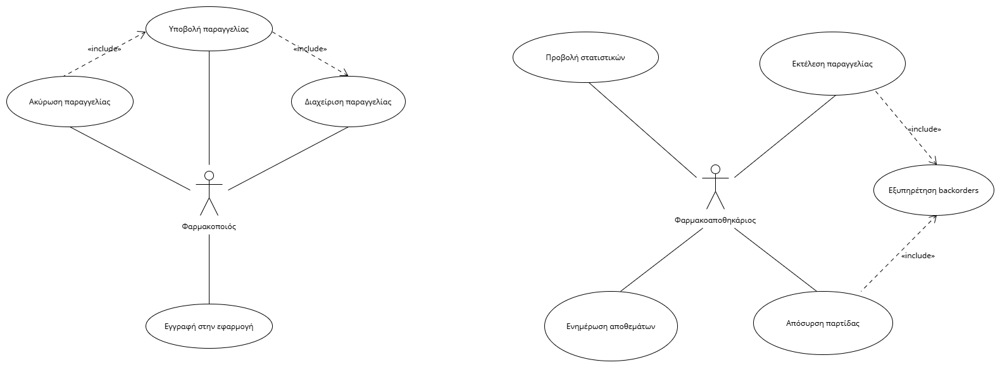|

---

## Διαγράμματα Δραστηριότητας
| **Activity Diagrams** | 
|-----------------------|
|      Cancel Order     | 
|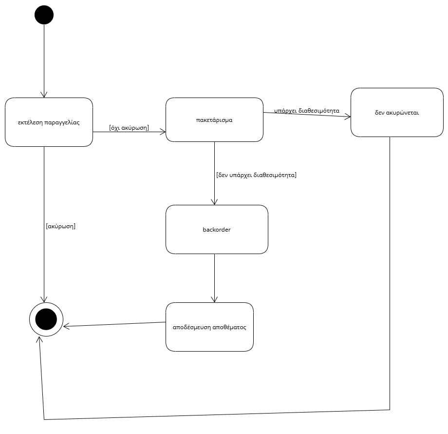|
|     Execute Order     | 
|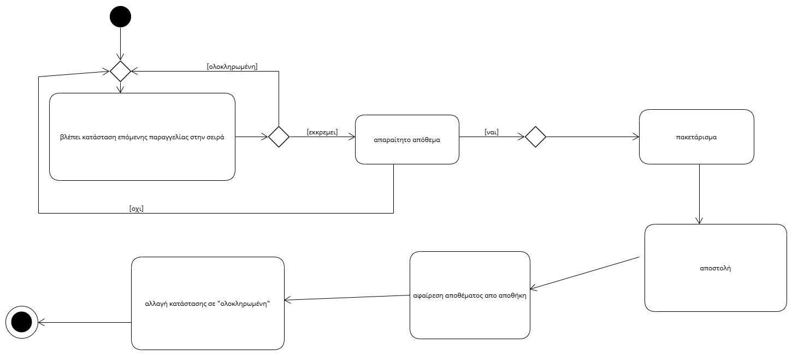|
|      Manage Order     | 
|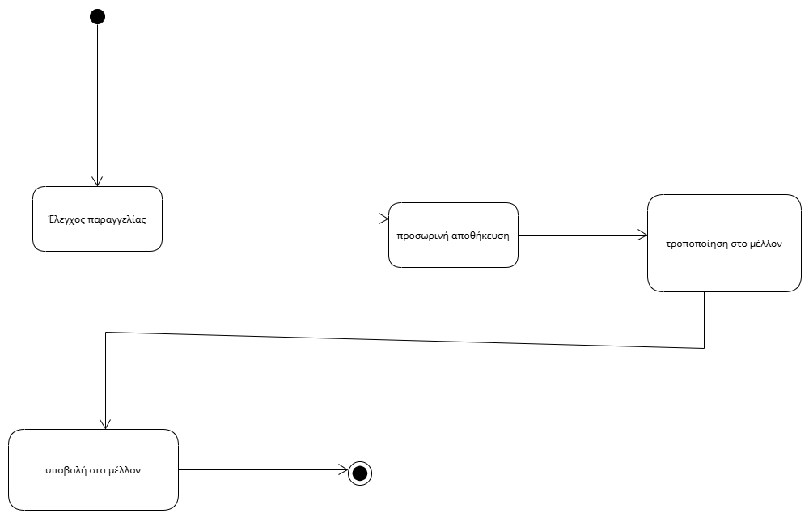|
|    Order Withdrawal   | 
|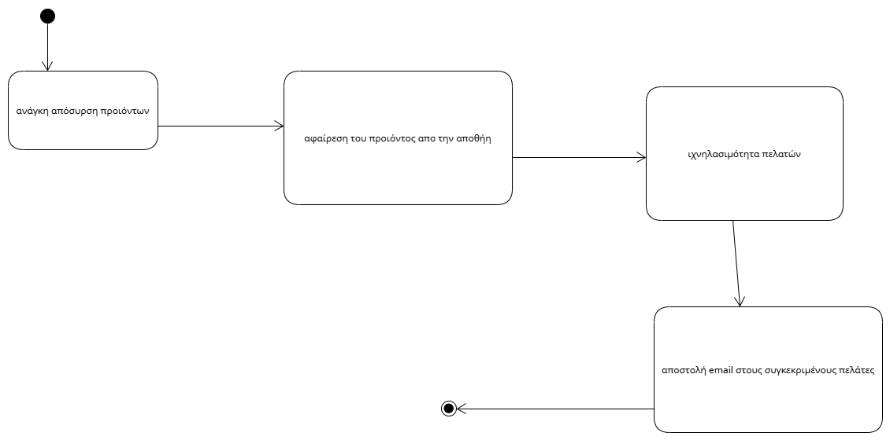|
|      Update Stock     | 
|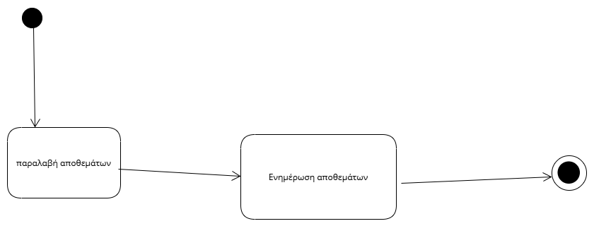|
|      Submit Order     | 
|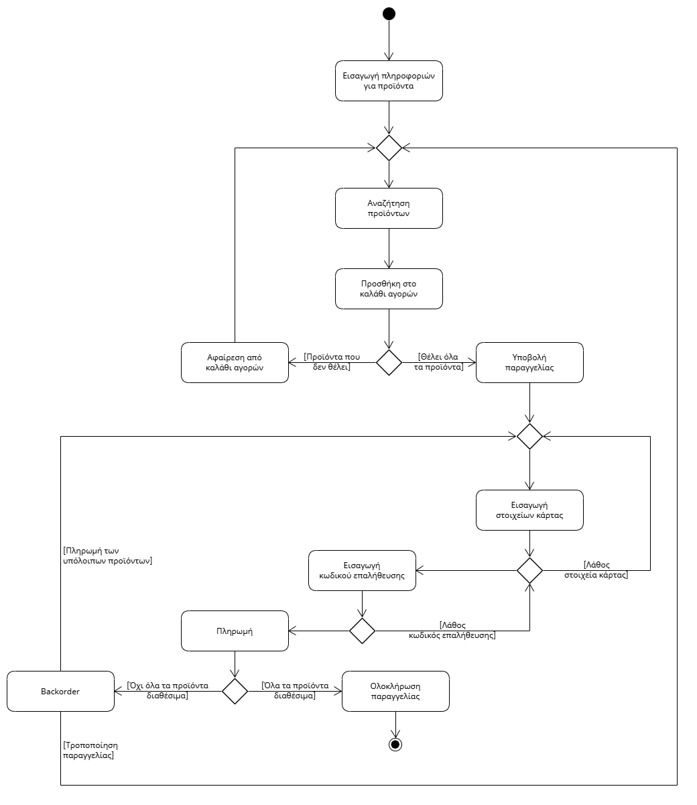|

---

## Διαγράμματα ακολουθίας
| **Sequence Diagrams** |  
|-----------------------|
|      Cancel Order     |  
|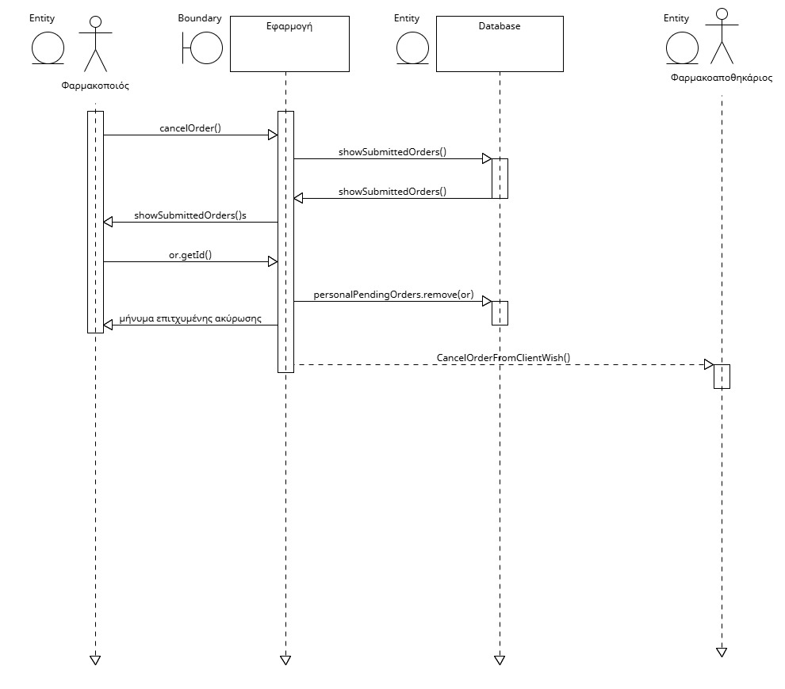|
|     Execute Order     | 
||
|      Manage Order     |  
|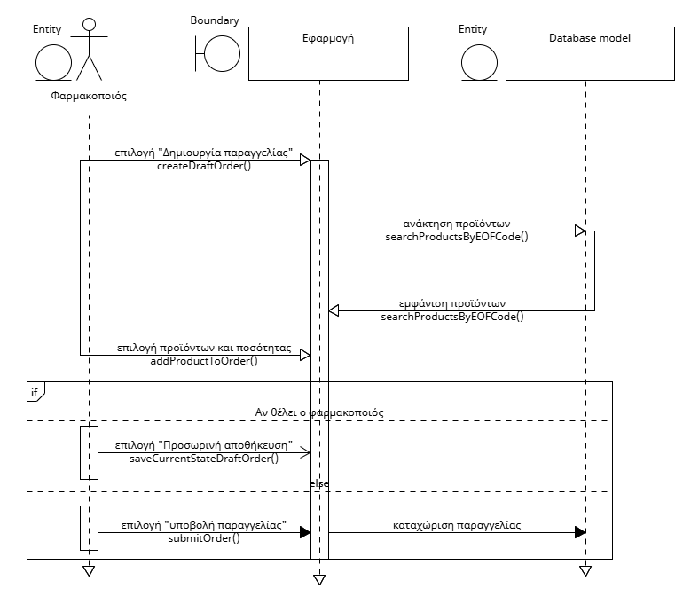|
|    Order Withdrawal   |  
|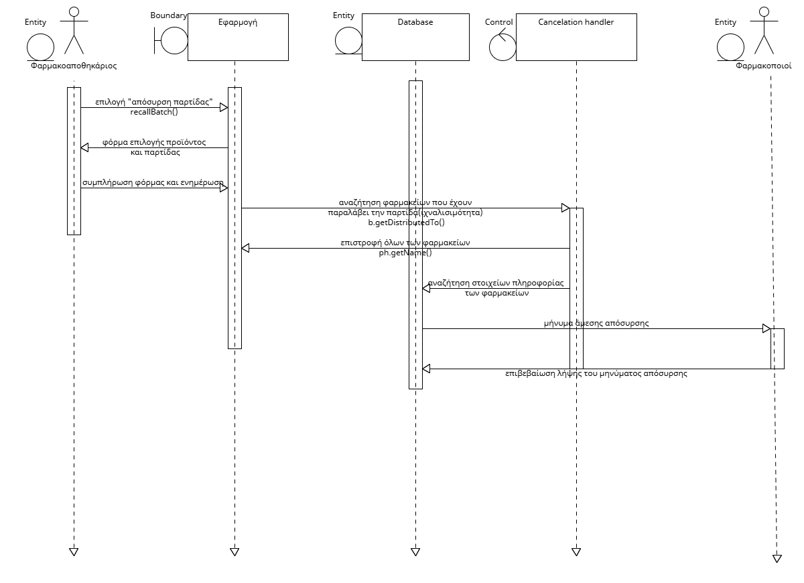|
|      Update Stock     |  
|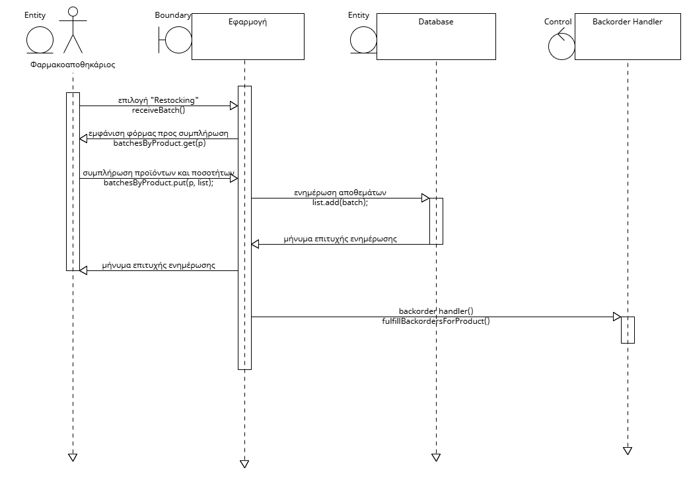|
|      Submit Order     |  
|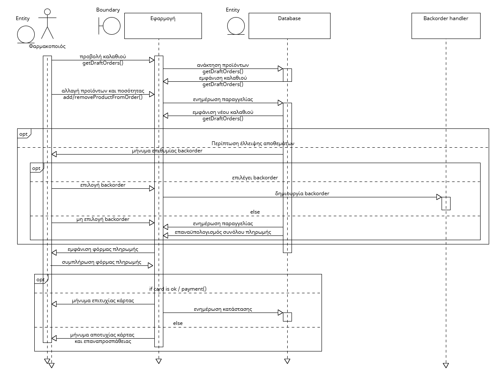|

---
## Μοντελοποίηση Πεδίου
| **Domain Model**                                             |
|--------------------------------------------------------------|
| 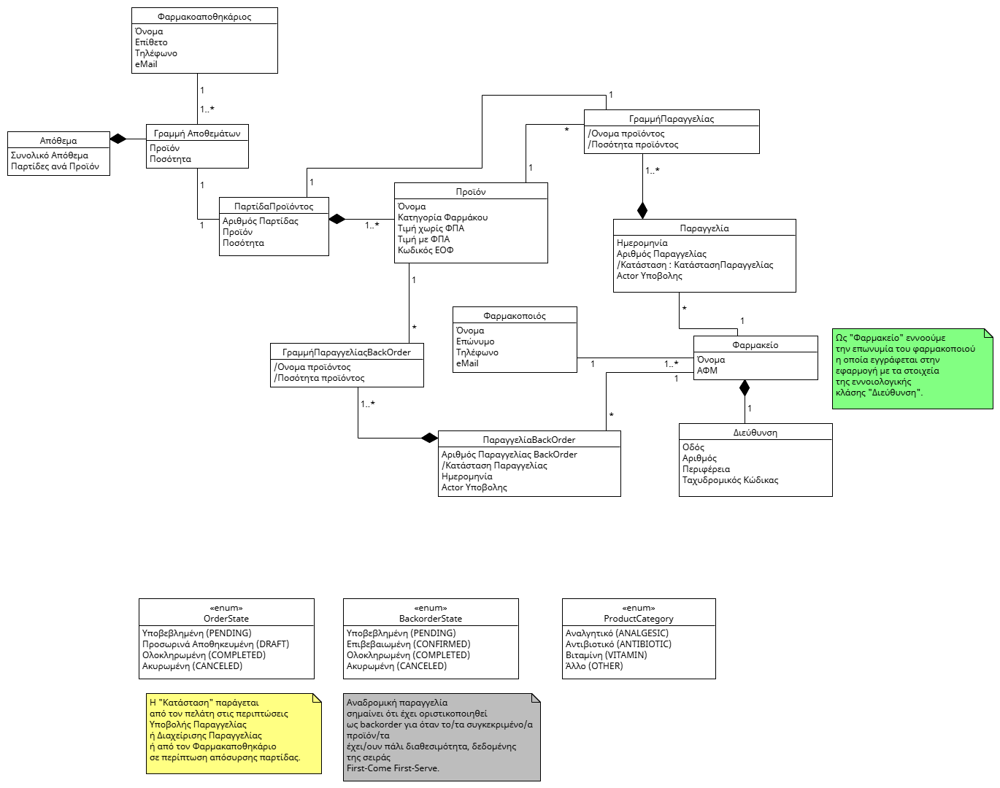 |

---
## Διάγραμμα Κλάσεων
| **Class Diagram**                                              |
|----------------------------------------------------------------|
| 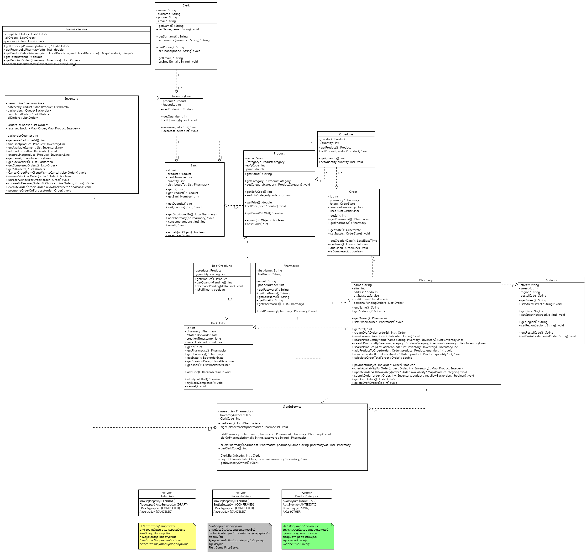  |

